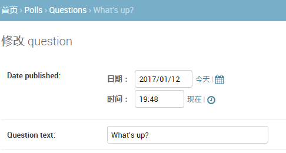
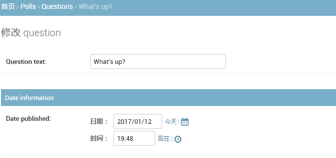
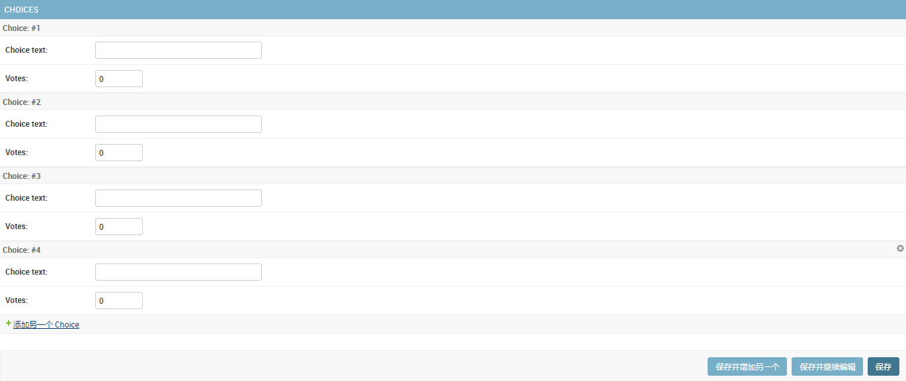
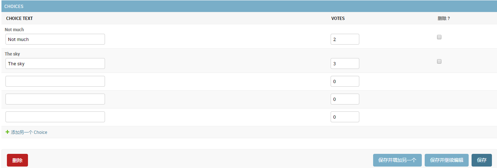

==========================
开发第一个Django应用,Part7
==========================

本教程上接 :doc:`Tutorial 6 </intro/tutorial06>` 。将继续完成这个投票应用,
本节将着重讲解如何使用Django自动生成后台管理网站。

自定义管理表单
==============

通过 ``admin.site.register(Question)`` 注册了 ``Question`` 后，Django可以自动构建一个默认的表单。
如果您需要自定义管理表单的外观和功能。你可以在注册时通过配置来实现。

现在先来试试重新排序表单上的字段。只需要将 ``admin.site.register(Question)`` 所在行替换为：

.. snippet::
    :filename: polls/admin.py

    from django.contrib import admin

    from .models import Question

    class QuestionAdmin(admin.ModelAdmin):
        fields = ['pub_date', 'question_text']

    admin.site.register(Question, QuestionAdmin)

你可以参照上面的形式，创建一个模型类，将之作为第二个参数传入 ``admin.site.register()``。
而且这种操作在任何时候都可以进行。

经过上面修改"Publication date"字段会在"Question"字段前面：

目前的表单只有两个字段可能看不出什么，但是对于一个字段很多的表单，设计一个直观合理的排序方式非常重要。
并且在字段数据很多时，还可以将表单分割成多个字段的集合：

.. snippet::
    :filename: polls/admin.py

    from django.contrib import admin

    from .models import Question

    class QuestionAdmin(admin.ModelAdmin):
        fieldsets = [
            (None,               {'fields': ['question_text']}),
            ('Date information', {'fields': ['pub_date']}),
        ]

    admin.site.register(Question, QuestionAdmin)

:attr:`~django.contrib.admin.ModelAdmin.fieldsets` 中每一个元组的第一个元素是该字段集合的标题。它让页面看起来像下面的样子：

添加关联对象
=============

现在 ``Question`` 的管理页面有了，但是一个 ``Question`` 应该有多个 ``Choices`` 。而此时管理页面并没有显示。

现在有两个方法可以解决这个问题。一是就像刚刚 ``Question`` 一样也将 ``Choice`` 注册到admin界面。代码像这样:

.. snippet::
    :filename: polls/admin.py

    from django.contrib import admin

    from .models import Choice, Question
    # ...
    admin.site.register(Choice)

现在Choice也可以在admin页面看见了，其中"Add choice"表单应该类似这样:

.. image:: _images/admin09.png
   :alt: Choice admin page

在这个表单中，Question字段是一个select选择框，包含了当前数据库中所有的Question实例。Django在admin站点中，
自动地将所有的 :class:`~django.db.models.ForeignKey` 关系展示为一个 ``select`` 框。在我们的例子中，
目前只有一个question对象存在。

请注意图中的绿色加号，它连接到Question模型。每一个包含 ``外键`` 关系的对象都会有这个绿色加号。点击它，
会弹出一个新增Question的表单，类似Question自己的添加表单。填入相关信息点击保存后，
Django自动将该Question保存在数据库，并作为当前Choice的关联外键对象。通俗讲就是，
新建一个Question并作为当前Choice的外键。

但是，实话说，这种创建方式的效率不怎么样。如果在创建Question对象的时候就可以直接添加一些Choice，
那样操作将会变得简单些。

删除Choice模型对 ``register()`` 方法的调用。然后，编辑Question的注册代码如下：

.. snippet::
    :filename: polls/admin.py

    from django.contrib import admin

    from .models import Choice, Question

    class ChoiceInline(admin.StackedInline):
        model = Choice
        extra = 3

    class QuestionAdmin(admin.ModelAdmin):
        fieldsets = [
            (None,               {'fields': ['question_text']}),
            ('Date information', {'fields': ['pub_date'], 'classes': ['collapse']}),
        ]
        inlines = [ChoiceInline]

    admin.site.register(Question, QuestionAdmin)

上面的代码告诉Django：Choice对象将在Question管理页面进行编辑，默认情况，请提供3个Choice对象的编辑区域。

现在"增加question"页面变成了这样:

.. image:: _images/admin10t.png
   :alt: Add question page now has choices on it

它的工作机制是：这里有3个插槽用于关联Choices，而且每当你重新返回一个已经存在的对象的“Change”页面，
你又将获得3个新的额外的插槽可用。

在3个插槽的最后，还有一个“Add another Choice”链接。点击它，又可以获得一个新的插槽。如果你想删除新增的插槽，
点击它右上方的X图标即可。但是，默认的三个插槽不可删除。下面是新增插槽的样子：

但是现在还有个小问题。上面页面中插槽纵队排列的方式需要占据大块的页面空间，看起来很不方便。为此，
Django提供了一种扁平化的显示方式，你仅仅只需要将 ``ChoiceInline`` 继承的类改为 ``admin.TabularInline``：

.. snippet::
    :filename: polls/admin.py

    class ChoiceInline(admin.TabularInline):
        #...

使用 ``TabularInline`` 代替 ``StackedInline``,相关的对象将以一种更紧凑的表格形式显示出来:

注意，这样多了一个"删除"选项，它允许你删除已经存在的Choice.

自定义修改列表
===============

现在Question的管理页面看起来已经差不多了，下面来看看修改列表页面，也就是显示了所有question的页面，即下图这个页面:

.. image:: _images/admin04t.png
   :alt: Polls change list page

Django默认只显示 ``str()`` 方法指定的内容。如果我们想要同时显示一些别的内容，可以使用 :attr:`~django.contrib.admin.ModelAdmin.list_display` 属性，
它是一个由多个字段组成的元组，其中的每一个字段都会按顺序显示在页面上，代码如下：

.. snippet::
    :filename: polls/admin.py

    class QuestionAdmin(admin.ModelAdmin):
        # ...
        list_display = ('question_text', 'pub_date')

同时，还可以把 :doc:`Tutorial 2 </intro/tutorial02>` 中的 ``was_published_recently()`` 方法也加入进来：

.. snippet::
    :filename: polls/admin.py

    class QuestionAdmin(admin.ModelAdmin):
        # ...
        list_display = ('question_text', 'pub_date', 'was_published_recently')

现在question的修改列表页面看起来像这样:

.. image:: _images/admin12t.png
   :alt: Polls change list page, updated

你可以点击其中一列的表头来让列表按照这列的值来进行排序，但是 ``was_published_recently`` 这列的表头不行,
因为Django不支持按照随便一个方法的输出进行排序。另请注意，默认情况下，``was_published_recently`` 的列标题是方法的名称（下划线替换为空格），
内容则是输出的字符串表示形式。

可以通过给方法 (in :file:`polls/models.py`) 提供一些属性来改进输出的样式，就如下面所示:

.. snippet::
    :filename: polls/models.py

    class Question(models.Model):
        # ...
        def was_published_recently(self):
            now = timezone.now()
            return now - datetime.timedelta(days=1) <= self.pub_date <= now
        was_published_recently.admin_order_field = 'pub_date'
        was_published_recently.boolean = True
        was_published_recently.short_description = 'Published recently?'

关于这些方法属性的更多信息，请参见 :attr:`~django.contrib.admin.ModelAdmin.list_display`。

我们还可以对显示结果进行过滤，通过使用 :attr:`~django.contrib.admin.ModelAdmin.list_filter` 属性。在 ``QuestionAdmin`` 中添加下面的代码::

    list_filter = ['pub_date']

它添加了一个“过滤器”侧边栏，这样就可以通过 ``pubdate`` 字段来过滤显示question:

.. image:: _images/admin13t.png
   :alt: Polls change list page, updated

过滤器显示的筛选类型取决与你过滤的字段，由于 ``pub_data`` 是 :class:`~django.db.models.DateTimeField`，
所以Django就自动给出了“今天”、“过去7天”、“本月”、“今年”这几个选项。

这一切进展顺利。再添加一些搜索功能::

    search_fields = ['question_text']

这行代码在修改列表的顶部添加了一个搜索框。 当进行搜索时，Django将在question_text字段中进行搜索。
你可以在 ``search_fields`` 中使用多个字段，但由于它在后台使用LIKE进行查询，尽量不要添加太多的字段，不然会降低数据库查询效率。

修改列表自带分页功能，默认每页展示100条数据。
Now's also a good time to note that change lists give you free pagination. The
default is to display 100 items per page. :attr:`Change list pagination
<django.contrib.admin.ModelAdmin.list_per_page>`, :attr:`search boxes
<django.contrib.admin.ModelAdmin.search_fields>`, :attr:`filters
<django.contrib.admin.ModelAdmin.list_filter>`, :attr:`date-hierarchies
<django.contrib.admin.ModelAdmin.date_hierarchy>`, 和
:attr:`column-header-ordering <django.contrib.admin.ModelAdmin.list_display>`
都会像你认为的那样工作。

自定义管理站点外观
===================

很明显，在每一个admin页面坐上顶端都显示“Django 管理”是感觉很荒诞，它仅仅是个占位文本。利用Django的模板系统，可以修改它。

它可以用Django的模板系统轻松改变。 Django的管理站点是Django自己生成出来的，它的界面代码使用的是Django自己的模板系统。

自定义项目模板
---------------

在项目的路劲下（包含 ``manage.py`` 的目录）创建一个名为 ``templates`` 目录。
Templates可以放在你的文件系统中Django所能访问到的任何地方。（运行Web服务器的用户即是运行Django的用户）。
但是作为一个好的习惯，最好把模板放在本项目目录下。

在配置文件中(:file:`mysite/settings.py`)的 :setting:`TEMPLATES` 中添加一个 :setting:`DIRS <TEMPLATES-DIRS>` 选项:

.. snippet::
    :filename: mysite/settings.py

    TEMPLATES = [
        {
            'BACKEND': 'django.template.backends.django.DjangoTemplates',
            'DIRS': [os.path.join(BASE_DIR, 'templates')],
            'APP_DIRS': True,
            'OPTIONS': {
                'context_processors': [
                    'django.template.context_processors.debug',
                    'django.template.context_processors.request',
                    'django.contrib.auth.context_processors.auth',
                    'django.contrib.messages.context_processors.messages',
                ],
            },
        },
    ]

:setting:`DIRS <TEMPLATES-DIRS>` 是在加载Django模板时检查的文件系统目录列表;它是一个搜索路径。

.. admonition:: 模板组织方式

    就像静态文件一样，我们可以把所有的模板都放在一起，形成一个大大的模板文件夹，并且工作正常。但是不建议这样！
    最好每一个模板都应该存放在它所属应用的模板目录内（例如 ``polls/templates``）
    而不是整个项目的模板目录（``templates``），因为这样每个应用才可以被方便和正确的复用。
    请参考 :doc:`复用app </intro/reusable-apps>`

接下来，在刚才创建的 ``templates`` 中创建一个 ``admin`` 目录，将 ``admin/base_site.html`` 模板文件拷贝到该目录内。
这个html文件来自Django源码，它位于 ``django/contrib/admin/templates`` 目录内。

.. admonition:: 如何找到Django源文件?

    在命令行中运行下面代码:
    .. code-block:: console

        $ python -c "import django; print(django.__path__)"

然后替换文件中的 ``{{ site_header|default:_('Django administration') }}`` (包括两个大括号),
换成你想要命名的名字即可。编辑完成后应该类似下面的代码片段：

.. code-block:: html+django

    
    <h1 id="site-name"><a href="">Polls Administration</a></h1>
    

这里仅仅是使用这种方法来教您如何覆盖模板。在实际的项目中,
您可以使用:attr:`django.contrib.admin.AdminSite.site_header` 属性更容易实现这个特殊的定制。

在这个模板文件中有许多类似这样的文本 ````、``{{ title }}``。``{%`` 和 ``{{``
都是Django模板语法的一部分。当Django渲染 ``admin/base_site.html`` 的时候，这个模板语言将被生成最终的html页面，
就像 :doc:`Tutorial 3 </intro/tutorial03>` 中一样。

注意任何Django管理站点的默认模板都可以重写。 想要重写一个模板文件，只需要做和重写 ``base_site.html``
相同的操作就行——将它从默认的目录拷贝到你自定义的目录中，然后修改它。

自定义应用模板
---------------

聪明的读者可能会问：但是 :setting:`DIRS <TEMPLATES-DIRS>` 默认是空的，Django是如何找到默认的admin模板呢？
回答是，由于 :setting:`APP_DIRS <TEMPLATES-APP_DIRS>` 被设置为 ``True``，
Django将自动查找每一个应用路径下的 ``templates/`` 子目录（不要忘了 ``django.contrib.admin`` 也是一个应用）。

我们的投票应用不太复杂，因此不需要自定义admin模板。但是如果它变得越来越复杂，
因为某些功能而需要修改Django的标准admin模板，那么修改的模板就比修改项目的模板更加明智。这样的话，
你可以将投票应用加入到任何新的项目中，并且保证能够找到它所需要的自定义模板。
更多关于Django如何加载模板文件的信息，请查看 :ref:`模板加载 <template-loading>` 的文档。

自定义管理站点首页
==================

在类似的情况下，您可能想要定制Django管理首页页面。默认情况下，
管理站点首页显示所有 :setting:`INSTALLED_APPS` 并在admin应用中注册过的app，以字母顺序进行排序。

要定制管理站点首页，需要重写 ``admin/index.html`` 模板，就像前面修改 ``base_site.html`` 模板的方法一样，
从源码目录拷贝到你指定的目录内。编辑该文件，你会看到文件内使用了一个 ``app_list`` 模板变量。
该变量包含了所有已经安装的Django应用。你可以硬编码链接到指定对象的admin页面，使用任何你认为好的方法，
用于替代这个 ``app_list``。

接下来做什么?
=============

入门教程到此结束。你可以在 :doc:`这里找到 </intro/whatsnext>` 接下来应该做什么。

如果您对Python包很熟悉，并且有兴趣了解如何将投票应用转换为“可复用应用程序”，
那么请查看高级教程::doc:`如何编写可复用的应用程序</intro/reusable-apps>`
